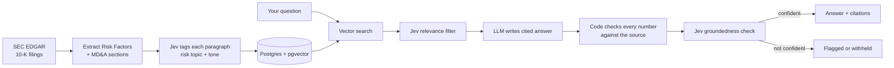

# 10k-analyst

**An AI analyst for SEC 10-K filings, built to catch hallucinations.**

## The idea

Most "AI for investing" tools hand a filing to a chatbot and hope the answer is right. That's a problem in finance, where one made up number can mislead an entire analysis.

I wanted to try a different approach, splitting the work the way people think:

- **Fast, bounded judgments** (*Is this paragraph about liquidity risk? Is this passage relevant to the question? Is this answer supported by the source?*) go to **Jev**, a new kind of "System One" decision model. It returns typed answers with a confidence score, runs cheaply enough to use on every paragraph, and can never answer outside the options it's given.
- **Slow, open-ended work** (writing a clear, cited answer) goes to an **LLM**.
- **Anything numeric** gets checked by **plain code**, because neither model should be trusted with arithmetic.

The result is a pipeline where every step either shows its confidence or shows its work, and low-confidence answers get flagged instead of presented as fact.

## How it works



1. **Ingest:** Pull 10-K filings from SEC EDGAR and keep the two sections that matter most for risk: Item 1A (Risk Factors) and Item 7 (Management's Discussion & Analysis).
2. **Tag:** Jev labels every paragraph with a risk topic and a tone score, each with a confidence value.
3. **Retrieve:** Find candidate paragraphs with vector search, then let Jev filter for relevance.
4. **Answer:** An LLM writes an answer that must cite the paragraphs it used.
5. **Verify:** Code confirms every figure appears in the cited text, and Jev checks whether the answer is actually supported. If not, the system says so.

## Results

*To be filled in from real runs. No numbers are estimated.*

| Metric | Result |
|---|---|
| Filings / paragraphs processed | 12 filings (6 companies × 2 years) → 3,246 paragraphs |
| Retrieval recall@5 (with vs. without Jev filter) | — |
| Unsupported answers caught by the verification gate | — |
| p95 latency per question | — |
| Cost per question | — |

## Tech stack

Python · FastAPI · PostgreSQL + pgvector · sentence-transformers · Jev (TypeSafe) · Claude API · Streamlit · Docker

## Getting started

```bash
git clone https://github.com/<your-username>/10k-analyst.git
cd 10k-analyst
cp .env.example .env       # add your API keys and SEC contact email
docker compose up -d       # starts Postgres + pgvector
uv sync                    # installs dependencies (Python 3.12, via uv)
uv run pytest              # smoke tests should pass without Jev or a live DB
uv run ruff check .        # lint
```

Retrieval, answering, and the demo UI require the phases below to be finished; right now this runs the scaffold and a `MockDecisionClient` standing in for Jev.

## Roadmap

- [ ] Project scaffold + local database
- [x] EDGAR ingestion (Risk Factors + MD&A)
- [ ] Paragraph tagging + embeddings
- [ ] Retrieval, answering, and verification
- [ ] Evaluation on a hand-checked question set
- [ ] Demo UI

## Limitations

- **Catches hallucinations; doesn't eliminate them.** The verification step reduces unsupported answers, and the evaluation measures how many still slip through.
- **Prose only.** Financial tables and statements aren't parsed yet.
- **Small scope:** a handful of companies, for demonstration.
- **Some filers structure their MD&A as a page-number pointer into a separate "wrap" section instead of writing it inline under Item 7** (seen in JPMorgan's and Chevron's 10-Ks). Ingestion doesn't follow that pointer, so such filers are left out of the MVP list rather than silently ingested with empty MD&A.

## Disclaimer

This is a personal research project, not investment advice.
