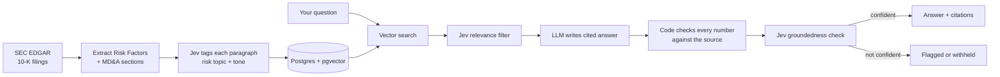

# 10k-analyst

**An AI analyst for SEC 10-K filings, built to catch hallucinations.**

## The idea

Most "AI for investing" tools hand a filing to a chatbot and hope the answer is right — risky in finance, where one made-up number can mislead an entire analysis. This project splits the work instead: fast, bounded judgments (*is this paragraph relevant? is this answer grounded?*) go to **Jev**, a confidence-scored "System One" decision model that can never answer outside the options it's given; open-ended writing goes to an **LLM**, which must cite the paragraphs it used; and every number in the answer is checked against the source text by **plain code**, since neither model should be trusted with arithmetic. The result is a pipeline where every step either shows its confidence or shows its work, and low-confidence answers get flagged instead of presented as fact.

## How it works



1. **Ingest:** Pull 10-K filings from SEC EDGAR and keep the two sections that matter most for risk: Item 1A (Risk Factors) and Item 7 (Management's Discussion & Analysis).
2. **Tag:** Jev labels every paragraph with a risk topic and a tone score, each with a confidence value.
3. **Retrieve:** Find candidate paragraphs with vector search, then let Jev filter for relevance.
4. **Answer:** An LLM writes an answer that must cite the paragraphs it used.
5. **Verify:** Code confirms every figure appears in the cited text, and Jev checks whether the answer is actually supported. If not, the system says so.

## Results

*From `scripts/run_eval.py` against 20 human-approved gold questions and 10 deliberately-unsupported answer fixtures. No numbers are estimated. Full results: `eval/results.json`.*

| Metric | Result |
|---|---|
| Filings / paragraphs processed | 13 filings (7 companies) → 3,793 paragraphs |
| Retrieval recall@5 (with vs. without Jev filter) | 0.85 / 0.85 |
| Fabricated numbers / hallucinated citations caught by the gate | 100% (7/7) |
| Unsupported claims caught by Jev's groundedness check (no numeric/citation issue) | 100% (3/3) |
| Abstention rate / gate precision | 0.05 / 0.40 |
| p50 / p95 latency per question | 3.9s / 5.4s |
| Cost per question | $0.0018 (Claude Haiku 4.5) |

All numbers are from a real run against real Jev (TypeSafe), not `MockDecisionClient`. Every deliberately-unsupported test case was caught — both the kind plain code can verify (fabricated numbers, citations to paragraphs that don't exist) and the kind that requires real semantic judgment (a claim that contradicts its own cited source). Gate precision (0.40) reflects something genuinely worth knowing for anyone tuning this further: most good answers land as "flagged" rather than "confident" — the `groundedness_threshold` (`config/thresholds.yaml`) is conservative out of the box and is an explicit target for calibration, not a bug.

## Tech stack

Python · FastAPI · PostgreSQL + pgvector · sentence-transformers · Jev (TypeSafe) · Claude API · Streamlit · Docker

## Getting started

Requires [Docker](https://www.docker.com/) and [uv](https://docs.astral.sh/uv/) installed first; `uv` installs the pinned Python 3.12 itself. You'll also need an [Anthropic API key](https://console.anthropic.com/).

**1. Setup and data pipeline:**

```bash
git clone https://github.com/<your-username>/10k-analyst.git
cd 10k-analyst
cp .env.example .env       # add your API keys and SEC contact email
docker compose up -d       # starts Postgres + pgvector
uv sync                    # installs dependencies (Python 3.12, via uv)
uv run pytest              # smoke tests should pass without Jev or a live DB
uv run ruff check .        # lint
uv run python scripts/ingest.py         # pull filings from EDGAR
uv run python scripts/tag_and_embed.py  # tag + embed into Postgres
```

**2. Try it — demo UI:**

```bash
uv run streamlit run streamlit_app.py
```

Opens at `http://localhost:8501`. Ask a question, pick an optional ticker/year/section, and see the answer, citations, verdict, and which retrieved chunks were kept or dropped and why.

**3. Or hit the API directly:**

```bash
uv run uvicorn report_qa.app:app --reload
```

```bash
curl -s localhost:8000/ask -H 'content-type: application/json' -d '{
  "question": "What does the company say about cybersecurity risk?",
  "ticker": "AAPL", "fiscal_year": 2025
}' | jq
```

**4. Reproduce the results table:**

```bash
uv run python scripts/run_eval.py
```

Uses real Jev if `JEV_API_KEY` is set in `.env`, otherwise falls back to a deterministic `MockDecisionClient` automatically (see `report_qa.decision.get_decision_client`).

## Roadmap

- [x] Project scaffold + local database
- [x] EDGAR ingestion (Risk Factors + MD&A)
- [x] Paragraph tagging + embeddings
- [x] Retrieval, answering, and verification
- [x] Evaluation on a hand-checked question set
- [x] Demo UI

## Limitations

- **Catches hallucinations; doesn't eliminate them.** The verification step reduces unsupported answers, and the evaluation measures how many still slip through.
- **Prose only.** Financial tables and statements aren't parsed yet.
- **Small scope:** a handful of companies, for demonstration.
- **Some filers structure their MD&A as a page-number pointer into a separate "wrap" section instead of writing it inline under Item 7** (seen in JPMorgan's and Chevron's 10-Ks). Ingestion doesn't follow that pointer. Chevron was left out of the MVP list for this reason; JPMorgan is included anyway because its Item 1A (Risk Factors) ingests cleanly — only its MD&A is a near-empty stub, not its risk factors.
- **The numeric check can false-flag a real number** if it's paraphrased rather than repeated verbatim in the cited paragraph (e.g. a year mentioned in the answer but not restated in the cited sentence). It's a substring heuristic, not semantic matching, so it errs toward flagging rather than missing a real hallucination.
- **Jev itself is weak at numbers, counting, dates, and literal reading** — that's a known property of the model, not a bug. It's why this architecture never asks Jev to do arithmetic: Jev only ever picks from a fixed option list or returns a bounded score, and every number in an answer is checked by plain code (`answer/numeric_check.py`) instead.
- **The groundedness gate is conservative out of the box.** Most grounded, correctly-cited answers land as "flagged" rather than "confident" with the default `groundedness_threshold` (see Results) — tune `config/thresholds.yaml` against your own data before trusting the "confident" bucket alone.
- **Without `JEV_API_KEY` set, the whole pipeline still runs end-to-end** via `MockDecisionClient`, a deterministic stand-in with no real understanding of the text — useful for development, but its verdicts aren't meaningful.

## Disclaimer

This is a personal research project, not investment advice.
